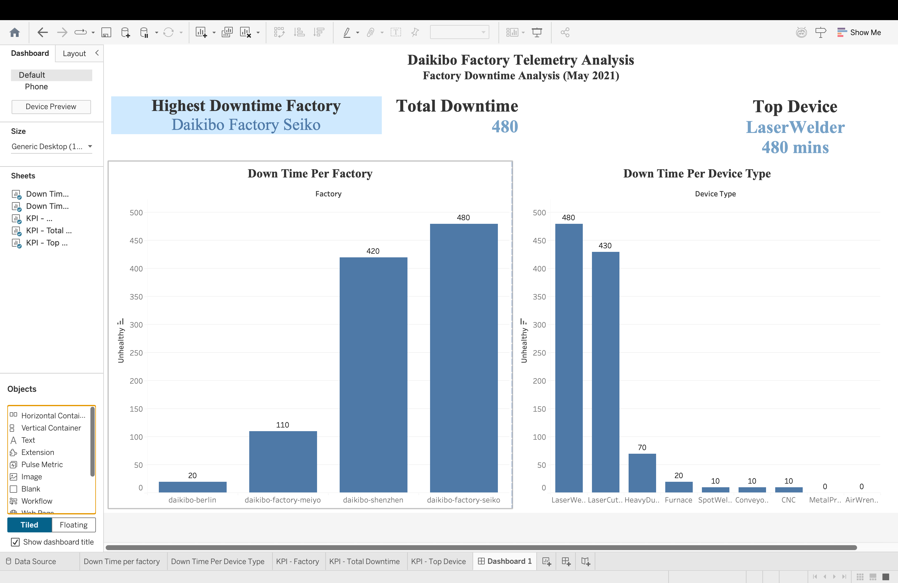

# 📊 Daikibo Telemetry Analysis Dashboard


---

## 📌 Project Overview

This project analyzes telemetry data collected from four Daikibo manufacturing plants during **May 2021** using **Tableau**.

The objective was to identify:

- Factory with the highest machine downtime
- Device types contributing the most downtime
- Interactive analysis using dashboard filters

---

## 🎯 Business Questions

- Which factory experienced the highest downtime?
- Which machine types broke most often in that factory?

---

## 🛠️ Tools Used

- Tableau Desktop
- JSON
- Data Visualization
- Dashboard Design

---

## 📈 Calculated Field

```tableau
IF [Status] = "unhealthy" THEN 10
ELSE 0
END
```

Each unhealthy status represents **10 minutes** of downtime.

---

## 📊 Dashboard Features

- Executive Dashboard
- Down Time per Factory
- Down Time per Device Type
- Interactive Filtering
- Professional Layout

---

## 🖼️ Dashboard Preview



---

## 💡 Key Insights

- 🏭 Highest Downtime Factory: **Daikibo Factory Seiko**
- ⚙️ Most Affected Device Type: **LaserWelder**
- ⏱️ Highest Recorded Downtime: **480 Minutes**

---

## 📂 Repository Structure

```text
dashboard/
images/
report/
README.md
```

---

## 🚀 Skills Demonstrated

- Tableau
- Data Cleaning
- Calculated Fields
- Dashboard Development
- Data Visualization
- Business Intelligence

---

## 👩‍💻 Author

**Sai Sahithi Palacharla**

Aspiring Data Analyst

- GitHub: https://github.com/saisahithipalacharla27
- LinkedIn: https://www.linkedin.com/in/sahithipalacharla/
